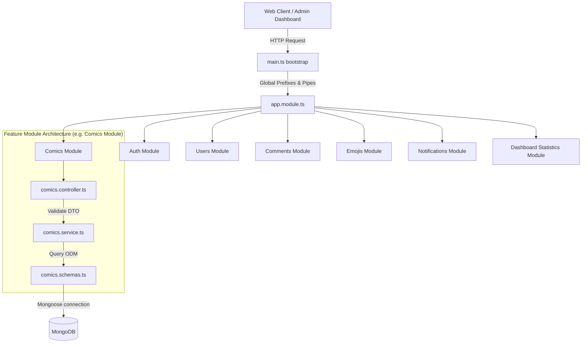

# System Architecture Documentation

This document describes the architectural design and structural paradigms of the **Ztruyện Backend** application.

---

## 1. Executive Summary

**Ztruyện Backend** acts as the core API server that powers the **Ztruyện** online comic-reading platform (serving both the public reading client and the administrator dashboard). 

The system is designed around a single cohesive backend (**Monolith**) using the **NestJS** framework. It manages account logins, social OAuth integrations, comic metadata indexing, user comments/replies, avatar decoration systems, system announcements, and real-time push alerts.

---

## 2. Technology Stack

The application uses modern Node.js backend technologies:

- **Core Runtime & Language:** Node.js, TypeScript (v4.9.5)
- **Application Framework:** NestJS (v9.4.0)
- **Database:** MongoDB (NoSQL) with Mongoose (v7.1.0) for schema definitions and queries
- **Security & Session Auth:** Passport (v0.6.0) supporting local registration/login and social login integrations (Google, Facebook, Discord OAuth2). Tokens are issued as JWT Access Tokens (Header-passed) and HTTP-only cookie-stored Refresh Tokens.
- **API Documentation:** Swagger / OpenAPI UI generated automatically via `@nestjs/swagger`.
- **Alerts & Notifications:** Firebase Admin SDK (v13.7.0) facilitating Firebase Cloud Messaging (FCM) push alerts.
- **Image Processing & Uploads:** Sharp (v0.34.4) for image manipulation, combined with custom bot scripts uploading media directly to Telegram chat channels.
- **Mailing Engine:** Resend API (v6.6.0) and Nodemailer supporting password resets and system emails formatted with Pug templates.
- **Testing Framework:** Jest (v29.5.0).

---

## 3. Architecture Pattern

The system adheres to NestJS's standard **Module-Based Dependency Injection (MVC / Component-based)** architectural style. 



### Architectural Key Concepts
- **Modular Inversion of Control (IoC):** Every capability (e.g. Auth, Users, Comics) is encapsulated into its own directory. Modules import and export services using NestJS dependency injectors.
- **Clear Layer Separation:**
  1. **Controllers (`*.controller.ts`):** Interface with incoming HTTP requests, validate query/body variables via `class-validator` DTOs, and output formatted JSON payloads.
  2. **Services (`*.service.ts`):** Execute business logic, manage transactional flows, throw HTTP exceptions, and communicate with database repositories.
  3. **Schemas (`*.schema.ts`):** Enforce data integrity, define indexes, hook pre-save events, and interact with the MongoDB ODM layer.
- **Response Standardization:** A global NestJS Interceptor (`core/`) intercept all outgoing payloads and wraps them in a unified response structure:
  ```json
  {
    "statusCode": 200,
    "message": "Success message",
    "data": { ... }
  }
  ```

---

## 4. Data Architecture

The data architecture is schema-oriented using **Mongoose** to enforce structures on top of **MongoDB**.

### Core Collections
- **`users`**: Main user table storing roles (User/Admin), providers, credentials, soft delete states, and FCM token rosters.
- **`comics`**: Comic book catalog storing ranking data, status, genres, and thumbnail pointers.
- **`comments`**: Comment posts containing nested child self-references (`parent`), author references (`userId`), likes, and replies count.
- **`commentlikes` / `commentreports`**: Junction tables mapping user-to-comment relationships (using unique compound indexes).
- **`favorites`**: User comic book lists mapped dynamically via unique keys.
- **`notifications`**: Recipient notification inbox using a Mongo TTL index to expire records automatically after 30 days.

For structural models, field types, and Mongoose indexing rules, see the [Data Models Guide](./data-models-backend.md).

---

## 5. API Design

API design is RESTful, conforming to standard URI routes.
- **Root Path:** `/api`
- **Default Version:** `/v1`
- **Response Types:** JSON payloads returned with standard HTTP status codes (200, 201, 400, 401, 403, 404, 500).

For a complete listing of endpoints, parameters, and roles access controls, see the [API Contracts Catalog](./api-contracts-backend.md).

---

## 6. Development & Deployment Workflow

### Development Loop
Developers write code locally in TypeScript. A file watcher compiles it on-the-fly when running:
```bash
npm run start:dev
```
A post-build step in `package.json` copies templates (Pug email structures) from `src/` to `dist/` dynamically to ensure resource availability.

### Deployment & CI/CD
Deployment is fully automated using **GitHub Actions** workflows triggered on pushes to the `main` branch. 
The pipeline compiles, tests, packages, and pushes the production distribution directly onto **Azure App Services (Azure Web Apps)** running on a Node.js environment.

For deployment environment configurations and step logs, see the [Deployment Guide](./deployment-guide.md).

---

## 7. Testing Strategy

The project utilizes **Jest** for automated testing:
- **Unit Testing:** Files named `*.spec.ts` are collocated next to controllers and services to validate individual blocks.
- **End-to-End Testing (E2E):** Located inside the `test/` directory, testing complete request-response integration flows by bootstrapping a test application.

To run tests locally:
```bash
npm run test
```

---

_Generated using BMAD Method `document-project` workflow_
