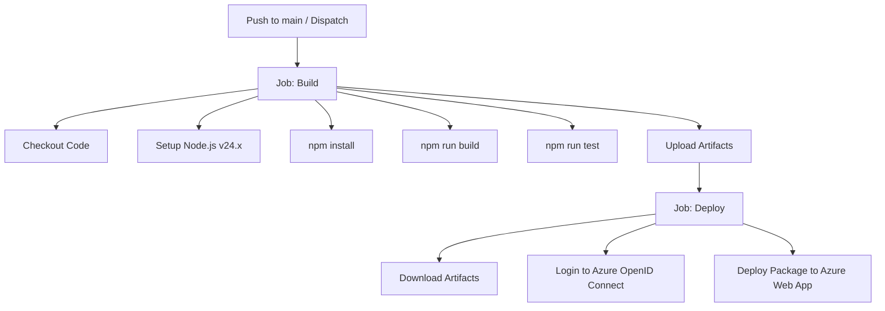

# Deployment & CI/CD Guide

This document explains the production deployment procedure and continuous integration (CI/CD) pipelines configuration for **Ztruyện Backend**.

---

## Azure Web App Hosting

The application is configured to run on **Azure Web Apps** under Node.js runtime environments. 
- **Application Name:** `ztruyen-be`
- **Deployment Slot:** `Production`

---

## CI/CD Pipeline Flow (GitHub Actions)

Continuous integration and continuous deployment are automated via GitHub Actions, configured in:
[.github/workflows/main_ztruyen-be.yml](file:///c:/butnt/nextjs/ztruyen-be/.github/workflows/main_ztruyen-be.yml).

### Trigger Rules
The workflow triggers on:
- **Pushes** directly targeting the `main` branch.
- **Manual dispatch** (`workflow_dispatch`), allowing developers to manually run the deploy run from the GitHub Actions tab.

---

## Workflow Jobs

The pipeline consists of two primary sequential jobs: `build` and `deploy`.



### 1. Build Job (`build`)
Runs on `ubuntu-latest`. It performs the following steps:
1. **Checkout:** Clones the code repo using `actions/checkout@v4`.
2. **Setup Node:** Configures Node.js runtime environment using `actions/setup-node@v3` set to **Node.js 24.x**.
3. **Install & Compile:** Runs `npm install`, then executes `npm run build` and runs unit tests via `npm run test` (if present).
4. **Publish Artifact:** Uploads the entire project workspace (including build `dist/` and package files) as a zip artifact named `node-app` using `actions/upload-artifact@v4`.

### 2. Deploy Job (`deploy`)
Runs on `ubuntu-latest` and depends on the successful completion of the `build` job.
1. **Download Artifact:** Retrieves the compiled package (`node-app`) using `actions/download-artifact@v4`.
2. **Azure Authenticate:** Logs into the Azure platform securely using OpenID Connect (OIDC) via `azure/login@v2` with client, tenant, and subscription IDs.
3. **Web App Deployment:** Deploys the package files to the Azure App Service host using `azure/webapps-deploy@v3`.

---

## Required Secret Variables

For the GitHub Actions workflow to run successfully, the following Azure credentials secrets must be configured in the GitHub repository repository settings (**Settings > Secrets and variables > Actions**):

| Secret Key | Description |
| :--- | :--- |
| `AZUREAPPSERVICE_CLIENTID_C9951962CDE34DAB85066B4860E02CC0` | App registration client ID (for Azure authentication login). |
| `AZUREAPPSERVICE_TENANTID_2851611D043A410D99382393C2A1CB14` | Directory Tenant ID of your Azure Active Directory. |
| `AZUREAPPSERVICE_SUBSCRIPTIONID_CD435A213B9C4350B8599D2576902F33` | Azure Subscription ID containing the target App Service resource. |

---

## Production Execution

Upon successful deployment to Azure, the application runs using the script command:
```bash
npm run start:prod
```
Which maps to `node dist/main` as configured in `package.json`. Make sure that all environment variables listed in the [Development Guide](./development-guide.md) are configured under the **Configuration > Application settings** tab in the Azure Web App portal.
